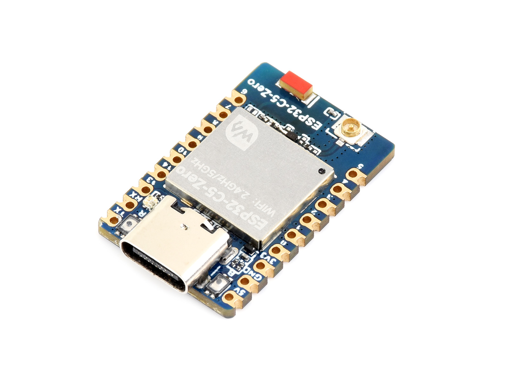

# Waveshare ESP32-C5-Zero Project Examples

[中文](README_ZH.md)

ESP32-C5-Zero(SMD board), ESP32-C5-Zero-M(pin-lined version) are small in size and adopt a half-hole process for easy integration into other motherboards. ESP32-C5-Zero onboard Type-C USB, leading out most of the unused pins under the small board shape. The ESP32-C5HF4 used is a system-on-chip (SoC) that integrates low-power Wi-Fi and BLE5 and has 4MB Flash. In addition, it has a hardware encryption accelerator, RNG, HMAC and Digital Signature module to meet the security requirements of the Internet of Things and rich peripheral interfaces. A variety of low-power operating states meet the power consumption needs of application scenarios such as the Internet of Things (IoT), mobile devices, wearable electronic devices, and smart homes.

- https://www.waveshare.com/esp32-c5-zero.htm
- https://docs.waveshare.com/ESP32-C5-Zero/

---

## 🔧 Setup

You can find detailed hardware resources, development environment setup, and quick‑start examples on the ESP32-C5-Zero product wiki page.

---

## 🛠️ Contributing

We welcome your contributions! You can help in the following ways:

1. Fork this repository.  
2. Create a new branch for your feature or bug fix.  
3. Commit your changes with a clear and descriptive message.  
4. Open a Pull Request for review.  

---

## 🧩 Issues & Support

If you run into any problems:

- First check the issues section at `https://gitee.com/waveshare/ESP32-C5-Zero/issues`.  
- Create a new issue and provide detailed information (symptoms, reproduction steps, hardware environment, etc.).  
- Refer to the documentation and example projects for troubleshooting tips.  
- Contact the Waveshare team and provide your order number for technical support.  

---

## 📜 License

This repository is licensed under the Apache License. For details, please refer to the [LICENSE](LICENSE) file.

---

## 🙌 Acknowledgements

- Thanks to Waveshare for providing the ESP32-C5-Zero hardware platform and software support.  
- Thanks to Espressif for their continuous support.  
- Thanks to all open‑source contributors who make these projects possible.  

---

Thank you for using ESP32-C5-Zero!
